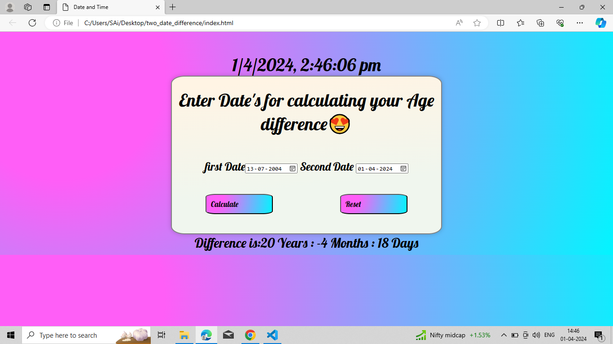

# **Diffrence Between Two Dates**
## - <u>steps: </u>
1. Enter Date One.
2. Enter Date Two.
3. Click on Claculate for calculating the difference.
4. Click on reset for reset the output.

# **Output**
